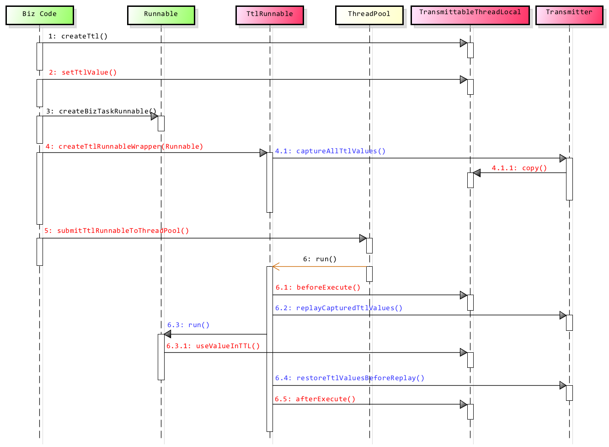

# 📌 TransmittableThreadLocal(TTL) 📌

[](https://travis-ci.org/alibaba/transmittable-thread-local)
[](https://ci.appveyor.com/project/oldratlee/transmittable-thread-local)
[](https://codecov.io/gh/alibaba/transmittable-thread-local/branch/master)
[](https://codeclimate.com/github/alibaba/transmittable-thread-local/maintainability)  
[](https://www.apache.org/licenses/LICENSE-2.0.html)
[](https://alibaba.github.io/transmittable-thread-local/apidocs/)
[](https://search.maven.org/search?q=g:com.alibaba%20AND%20a:transmittable-thread-local&core=gav)
[](https://github.com/alibaba/transmittable-thread-local/releases)  
[](https://gitter.im/alibaba/transmittable-thread-local?utm_source=badge&utm_medium=badge&utm_campaign=pr-badge&utm_content=badge)
[](https://github.com/alibaba/transmittable-thread-local/stargazers)
[](https://github.com/alibaba/transmittable-thread-local/fork)
[](https://github.com/alibaba/transmittable-thread-local/issues)
[](https://github.com/alibaba/transmittable-thread-local/issues "Percentage of issues still open")

[📖 English Documentation](README-EN.md) | 📖 中文文档

----------------------------------------

<!-- START doctoc generated TOC please keep comment here to allow auto update -->
<!-- DON'T EDIT THIS SECTION, INSTEAD RE-RUN doctoc TO UPDATE -->


- [🔧 功能](#-%E5%8A%9F%E8%83%BD)
- [🎨 需求场景](#-%E9%9C%80%E6%B1%82%E5%9C%BA%E6%99%AF)
- [👥 User Guide](#-user-guide)
    - [1. 简单使用](#1-%E7%AE%80%E5%8D%95%E4%BD%BF%E7%94%A8)
    - [2. 保证线程池中传递值](#2-%E4%BF%9D%E8%AF%81%E7%BA%BF%E7%A8%8B%E6%B1%A0%E4%B8%AD%E4%BC%A0%E9%80%92%E5%80%BC)
        - [2.1 修饰`Runnable`和`Callable`](#21-%E4%BF%AE%E9%A5%B0runnable%E5%92%8Ccallable)
            - [整个过程的完整时序图](#%E6%95%B4%E4%B8%AA%E8%BF%87%E7%A8%8B%E7%9A%84%E5%AE%8C%E6%95%B4%E6%97%B6%E5%BA%8F%E5%9B%BE)
        - [2.2 修饰线程池](#22-%E4%BF%AE%E9%A5%B0%E7%BA%BF%E7%A8%8B%E6%B1%A0)
        - [2.3 使用`Java Agent`来修饰`JDK`线程池实现类](#23-%E4%BD%BF%E7%94%A8java-agent%E6%9D%A5%E4%BF%AE%E9%A5%B0jdk%E7%BA%BF%E7%A8%8B%E6%B1%A0%E5%AE%9E%E7%8E%B0%E7%B1%BB)
            - [关于`boot class path`设置](#%E5%85%B3%E4%BA%8Eboot-class-path%E8%AE%BE%E7%BD%AE)
            - [`Java`的启动参数配置](#java%E7%9A%84%E5%90%AF%E5%8A%A8%E5%8F%82%E6%95%B0%E9%85%8D%E7%BD%AE)
- [🔌 Java API Docs](#-java-api-docs)
- [🍪 Maven依赖](#-maven%E4%BE%9D%E8%B5%96)
- [🔨 关于编译构建与`IDE`开发](#-%E5%85%B3%E4%BA%8E%E7%BC%96%E8%AF%91%E6%9E%84%E5%BB%BA%E4%B8%8Eide%E5%BC%80%E5%8F%91)
- [❓ FAQ](#-faq)
- [🗿 更多文档](#-%E6%9B%B4%E5%A4%9A%E6%96%87%E6%A1%A3)
- [📚 相关资料](#-%E7%9B%B8%E5%85%B3%E8%B5%84%E6%96%99)
    - [Jdk Core Classes](#jdk-core-classes)
- [👷 Contributors](#-contributors)

<!-- END doctoc generated TOC please keep comment here to allow auto update -->

----------------------------------------

# 🔧 功能

👉 在使用线程池等会池化复用线程的执行组件情况下，提供`ThreadLocal`值的传递功能，解决异步执行时上下文传递的问题。
一个`Java`标准库本应为框架/中间件设施开发提供的标配能力，本库功能聚焦 & 0依赖，支持`Java` 16/15/14/13/12/11/10/9/8/7/6。

`JDK`的[`InheritableThreadLocal`](https://docs.oracle.com/javase/10/docs/api/java/lang/InheritableThreadLocal.html)类可以完成父线程到子线程的值传递。但对于使用线程池等会池化复用线程的执行组件的情况，线程由线程池创建好，并且线程是池化起来反复使用的；这时父子线程关系的`ThreadLocal`值传递已经没有意义，应用需要的实际上是把 **任务提交给线程池时**的`ThreadLocal`值传递到 **任务执行时**。

本库提供的[`TransmittableThreadLocal`](src/main/java/com/alibaba/ttl/TransmittableThreadLocal.java)类继承并加强[`InheritableThreadLocal`](https://docs.oracle.com/javase/10/docs/api/java/lang/InheritableThreadLocal.html)类，解决上述的问题，使用详见[User Guide](#-user-guide)。

整个`TransmittableThreadLocal`库的核心功能（用户`API`与框架/中间件的集成`API`、线程池`ExecutorService`/`ForkJoinPool`/`TimerTask`及其线程工厂的`Wrapper`），只有 **_~1000 `SLOC`代码行_**，非常精小。

欢迎 👏

- 建议和提问，[提交`Issue`](https://github.com/alibaba/transmittable-thread-local/issues/new)
- 贡献和改进，[`Fork`后提通过`Pull Request`贡献代码](https://github.com/alibaba/transmittable-thread-local/fork)

# 🎨 需求场景

在`ThreadLocal`的需求场景即是`TransmittableThreadLocal`的潜在需求场景，如果你的业务需要『在使用线程池等会池化复用线程的执行组件情况下传递`ThreadLocal`』则是`TransmittableThreadLocal`目标场景。

下面是几个典型场景例子。

1. 分布式跟踪系统 或 全链路压测（即链路打标）
2. 日志收集记录系统上下文
3. `Session`级`Cache`
4. 应用容器或上层框架跨应用代码给下层`SDK`传递信息

各个场景的展开说明参见子文档 [需求场景](docs/requirement-scenario.md)。

# 👥 User Guide

使用类[`TransmittableThreadLocal`](src/main/java/com/alibaba/ttl/TransmittableThreadLocal.java)来保存值，并跨线程池传递。

[`TransmittableThreadLocal`](src/main/java/com/alibaba/ttl/TransmittableThreadLocal.java)继承[`InheritableThreadLocal`](https://docs.oracle.com/javase/10/docs/api/java/lang/InheritableThreadLocal.html)，使用方式也类似。

相比[`InheritableThreadLocal`](https://docs.oracle.com/javase/10/docs/api/java/lang/InheritableThreadLocal.html)，添加了

1. `copy`方法  
    用于定制 **任务提交给线程池时** 的`ThreadLocal`值传递到 **任务执行时** 的拷贝行为，缺省传递的是引用。  
    注意：如果跨线程传递了对象引用因为不再有线程封闭，与`InheritableThreadLocal.childValue`一样，使用者/业务逻辑要注意传递对象的线程安全。
1. `protected`的`beforeExecute`/`afterExecute`方法  
    执行任务(`Runnable`/`Callable`)的前/后的生命周期回调，缺省是空操作。

具体使用方式见下面的说明。

## 1. 简单使用

父线程给子线程传递值。

示例代码：

```java
// 在父线程中设置
TransmittableThreadLocal<String> context = new TransmittableThreadLocal<String>();
context.set("value-set-in-parent");

// =====================================================

// 在子线程中可以读取，值是"value-set-in-parent"
String value = context.get();
```

\# 完整可运行的Demo代码参见[`SimpleDemo.kt`](src/test/java/com/alibaba/demo/ttl/SimpleDemo.kt)。

这是其实是[`InheritableThreadLocal`](https://docs.oracle.com/javase/10/docs/api/java/lang/InheritableThreadLocal.html)的功能，应该使用[`InheritableThreadLocal`](https://docs.oracle.com/javase/10/docs/api/java/lang/InheritableThreadLocal.html)来完成。

但对于使用线程池等会池化复用线程的执行组件的情况，线程由线程池创建好，并且线程是池化起来反复使用的；这时父子线程关系的`ThreadLocal`值传递已经没有意义，应用需要的实际上是把 **任务提交给线程池时**的`ThreadLocal`值传递到 **任务执行时**。

解决方法参见下面的这几种用法。

## 2. 保证线程池中传递值

### 2.1 修饰`Runnable`和`Callable`

使用[`TtlRunnable`](src/main/java/com/alibaba/ttl/TtlRunnable.java)和[`TtlCallable`](src/main/java/com/alibaba/ttl/TtlCallable.java)来修饰传入线程池的`Runnable`和`Callable`。

示例代码：

```java
TransmittableThreadLocal<String> context = new TransmittableThreadLocal<String>();
context.set("value-set-in-parent");

Runnable task = new RunnableTask();
// 额外的处理，生成修饰了的对象ttlRunnable
Runnable ttlRunnable = TtlRunnable.get(task);
executorService.submit(ttlRunnable);

// =====================================================

// Task中可以读取，值是"value-set-in-parent"
String value = context.get();
```

上面演示了`Runnable`，`Callable`的处理类似

```java
TransmittableThreadLocal<String> context = new TransmittableThreadLocal<String>();
context.set("value-set-in-parent");

Callable call = new CallableTask();
// 额外的处理，生成修饰了的对象ttlCallable
Callable ttlCallable = TtlCallable.get(call);
executorService.submit(ttlCallable);

// =====================================================

// Call中可以读取，值是"value-set-in-parent"
String value = context.get();
```

\# 完整可运行的Demo代码参见[`TtlWrapperDemo.kt`](src/test/java/com/alibaba/demo/ttl/TtlWrapperDemo.kt)。

#### 整个过程的完整时序图



### 2.2 修饰线程池

省去每次`Runnable`和`Callable`传入线程池时的修饰，这个逻辑可以在线程池中完成。

通过工具类[`com.alibaba.ttl.threadpool.TtlExecutors`](src/main/java/com/alibaba/ttl/threadpool/TtlExecutors.java)完成，有下面的方法：

- `getTtlExecutor`：修饰接口`Executor`
- `getTtlExecutorService`：修饰接口`ExecutorService`
- `getTtlScheduledExecutorService`：修饰接口`ScheduledExecutorService`

示例代码：

```java
ExecutorService executorService = ...
// 额外的处理，生成修饰了的对象executorService
executorService = TtlExecutors.getTtlExecutorService(executorService);

TransmittableThreadLocal<String> context = new TransmittableThreadLocal<String>();
context.set("value-set-in-parent");

Runnable task = new RunnableTask();
Callable call = new CallableTask();
executorService.submit(task);
executorService.submit(call);

// =====================================================

// Task或是Call中可以读取，值是"value-set-in-parent"
String value = context.get();
```

\# 完整可运行的Demo代码参见[`TtlExecutorWrapperDemo.kt`](src/test/java/com/alibaba/demo/ttl/TtlExecutorWrapperDemo.kt)。

### 2.3 使用`Java Agent`来修饰`JDK`线程池实现类

这种方式，实现线程池的传递是透明的，业务代码中没有修饰`Runnable`或是线程池的代码。即可以做到应用代码 **无侵入**。  
\# 关于 **无侵入** 的更多说明参见文档[`Java Agent`方式对应用代码无侵入](docs/developer-guide.md#java-agent%E6%96%B9%E5%BC%8F%E5%AF%B9%E5%BA%94%E7%94%A8%E4%BB%A3%E7%A0%81%E6%97%A0%E4%BE%B5%E5%85%A5)。

示例代码：

```java
// ## 1. 框架上层逻辑，后续流程框架调用业务 ##
TransmittableThreadLocal<String> context = new TransmittableThreadLocal<String>();
context.set("value-set-in-parent");

// ## 2. 应用逻辑，后续流程业务调用框架下层逻辑 ##
ExecutorService executorService = Executors.newFixedThreadPool(3);

Runnable task = new RunnableTask();
Callable call = new CallableTask();
executorService.submit(task);
executorService.submit(call);

// ## 3. 框架下层逻辑 ##
// Task或是Call中可以读取，值是"value-set-in-parent"
String value = context.get();
```

Demo参见[`AgentDemo.kt`](src/test/java/com/alibaba/demo/ttl/agent/AgentDemo.kt)。执行工程下的脚本[`scripts/run-agent-demo.sh`](scripts/run-agent-demo.sh)即可运行Demo。

目前`TTL Agent`中，修饰了的`JDK`执行器组件（即如线程池）如下：

1. `java.util.concurrent.ThreadPoolExecutor` 和 `java.util.concurrent.ScheduledThreadPoolExecutor`
    - 修饰实现代码在[`TtlExecutorTransformlet.java`](src/main/java/com/alibaba/ttl/threadpool/agent/internal/transformlet/impl/TtlExecutorTransformlet.java)。
1. `java.util.concurrent.ForkJoinTask`（对应的执行器组件是`java.util.concurrent.ForkJoinPool`）
    - 修饰实现代码在[`TtlForkJoinTransformlet.java`](src/main/java/com/alibaba/ttl/threadpool/agent/internal/transformlet/impl/TtlForkJoinTransformlet.java)。从版本 **_`2.5.1`_** 开始支持。
    - **_注意_**：`Java 8`引入的[**_`CompletableFuture`_**](https://docs.oracle.com/en/java/javase/11/docs/api/java.base/java/util/concurrent/CompletableFuture.html)与（并行执行的）[**_`Stream`_**](https://docs.oracle.com/en/java/javase/11/docs/api/java.base/java/util/stream/package-summary.html)底层是通过`ForkJoinPool`来执行，所以支持`ForkJoinPool`后，`TTL`也就透明支持了`CompletableFuture`与`Stream`。🎉
1. `java.util.TimerTask`的子类（对应的执行器组件是`java.util.Timer`）
    - 修饰实现代码在[`TtlTimerTaskTransformlet.java`](src/main/java/com/alibaba/ttl/threadpool/agent/internal/transformlet/impl/TtlTimerTaskTransformlet.java)。从版本 **_`2.7.0`_** 开始支持。
    - **_注意_**：从`2.11.2`版本开始缺省开启`TimerTask`的修饰（因为保证正确性是第一位，而不是最佳实践『不推荐使用`TimerTask`』:）；`2.11.1`版本及其之前的版本没有缺省开启`TimerTask`的修饰。
    - 使用`Agent`参数`ttl.agent.enable.timer.task`开启/关闭`TimerTask`的修饰：
        - `-javaagent:path/to/transmittable-thread-local-2.x.x.jar=ttl.agent.enable.timer.task:true`
        - `-javaagent:path/to/transmittable-thread-local-2.x.x.jar=ttl.agent.enable.timer.task:false`
    - 更多关于`TTL Agent`参数的配置说明详见[`TtlAgent.java`的JavaDoc](src/main/java/com/alibaba/ttl/threadpool/agent/TtlAgent.java)。

> **关于`java.util.TimerTask`/`java.util.Timer`**
>
> `Timer`是`JDK 1.3`的老类，不推荐使用`Timer`类。
>
> 推荐用[`ScheduledExecutorService`](https://docs.oracle.com/javase/10/docs/api/java/util/concurrent/ScheduledExecutorService.html)。  
> `ScheduledThreadPoolExecutor`实现更强壮，并且功能更丰富。
> 如支持配置线程池的大小（`Timer`只有一个线程）；`Timer`在`Runnable`中抛出异常会中止定时执行。更多说明参见[10. **Mandatory** Run multiple TimeTask by using ScheduledExecutorService rather than Timer because Timer will kill all running threads in case of failing to catch exceptions. - Alibaba Java Coding Guidelines](https://alibaba.github.io/Alibaba-Java-Coding-Guidelines/#concurrency)。

#### 关于`boot class path`设置

因为修饰了`JDK`标准库的类，标准库由`bootstrap class loader`加载；修饰后的`JDK`类引用了`TTL`的代码，所以`Java Agent`使用方式下`TTL Jar`文件需要配置到`boot class path`上。

`TTL`从`v2.6.0`开始，加载`TTL Agent`时会自动设置`TTL Jar`到`boot class path`上。  
**_注意_**：不能修改从`Maven`库下载的`TTL Jar`文件名（形如`transmittable-thread-local-2.x.x.jar`）。
如果修改了，则需要自己手动通过`-Xbootclasspath JVM`参数来显式配置（就像`TTL`之前的版本的做法一样）。

自动设置`TTL Jar`到`boot class path`的实现是通过指定`TTL Java Agent Jar`文件里`manifest`文件（`META-INF/MANIFEST.MF`）的`Boot-Class-Path`属性：

> `Boot-Class-Path`
>
> A list of paths to be searched by the bootstrap class loader. Paths represent directories or libraries (commonly referred to as JAR or zip libraries on many platforms).
> These paths are searched by the bootstrap class loader after the platform specific mechanisms of locating a class have failed. Paths are searched in the order listed.

更多详见

- [`Java Agent`规范 - `JavaDoc`](https://docs.oracle.com/javase/10/docs/api/java/lang/instrument/package-summary.html#package.description)
- [JAR File Specification - JAR Manifest](https://docs.oracle.com/javase/10/docs/specs/jar/jar.html#jar-manifest)
- [Working with Manifest Files - The Java™ TutorialsHide](https://docs.oracle.com/javase/tutorial/deployment/jar/manifestindex.html)

#### `Java`的启动参数配置

在`Java`的启动参数加上：`-javaagent:path/to/transmittable-thread-local-2.x.x.jar`。

如果修改了下载的`TTL`的`Jar`的文件名（`transmittable-thread-local-2.x.x.jar`），则需要自己手动通过`-Xbootclasspath JVM`参数来显式配置：  
比如修改文件名成`ttl-foo-name-changed.jar`，则还加上`Java`的启动参数：`-Xbootclasspath/a:path/to/ttl-foo-name-changed.jar`

`Java`命令行示例如下：

```bash
java -javaagent:path/to/transmittable-thread-local-2.x.x.jar \
    -cp classes \
    com.alibaba.demo.ttl.agent.AgentDemo
```

或是

```bash
# 如果修改了TTL jar文件名 或 TTL版本是 2.6.0 之前，
# 则还需要显式设置 -Xbootclasspath 参数
java -javaagent:path/to/ttl-foo-name-changed.jar \
    -Xbootclasspath/a:path/to/ttl-foo-name-changed.jar \
    -cp classes \
    com.alibaba.demo.ttl.agent.AgentDemo
```

# 🔌 Java API Docs

当前版本的Java API文档地址： <https://alibaba.github.io/transmittable-thread-local/apidocs/>

# 🍪 Maven依赖

示例：

```xml
<dependency>
    <groupId>com.alibaba</groupId>
    <artifactId>transmittable-thread-local</artifactId>
    <version>2.11.5</version>
</dependency>
```

可以在 [search.maven.org](https://search.maven.org/search?q=g:com.alibaba%20AND%20a:transmittable-thread-local&core=gav) 查看可用的版本。

# 🔨 关于编译构建与`IDE`开发

编译构建的环境要求： **_`JDK 8~11`_**；用`Maven`常规的方式执行编译构建即可：  
\# 在工程中已经包含了符合版本要求的`Maven`，直接运行 **_工程根目录下的`mvnw`_**；并不需要先手动自己安装好`Maven`。

```bash
# 运行测试Case
./mvnw test
# 编译打包
./mvnw package
# 运行测试Case、编译打包、安装TTL库到Maven本地
./mvnw install

#####################################################
# 如果使用你自己安装的`Maven`，版本要求：maven 3.3.9+
mvn install
```

如何用`IDE`来开发时注意点，更多说明参见 [文档 如何用`IDE`开发 - Developer Guide](docs/developer-guide.md#%E5%A6%82%E4%BD%95%E7%94%A8ide%E5%BC%80%E5%8F%91)。

# ❓ FAQ

- Mac OS X下，使用javaagent，可能会报`JavaLaunchHelper`的出错信息。  
    JDK Bug: <http://bugs.sun.com/bugdatabase/view_bug.do?bug_id=8021205>  
    可以换一个版本的JDK。我的开发机上`1.7.0_40`有这个问题，`1.6.0_51`、`1.7.0_45`可以运行。  
    \# `1.7.0_45`还是有`JavaLaunchHelper`的出错信息，但不影响运行。

# 🗿 更多文档

- [🎨 需求场景说明](docs/requirement-scenario.md)
- [🎓 Developer Guide](docs/developer-guide.md)
- [☔ 性能测试](docs/performance-test.md)

# 📚 相关资料

## Jdk Core Classes

- [WeakHashMap](https://docs.oracle.com/javase/10/docs/api/java/util/WeakHashMap.html)
- [InheritableThreadLocal](https://docs.oracle.com/javase/10/docs/api/java/lang/InheritableThreadLocal.html)

# 👷 Contributors

- Jerry Lee \<oldratlee at gmail dot com> [@oldratlee](https://github.com/oldratlee)
- Yang Fang \<snoop.fy at gmail dot com> [@driventokill](https://github.com/driventokill)
- Zava Xu \<zava.kid at gmail dot com> [@zavakid](https://github.com/zavakid)
- wuwen \<wuwen.55 at aliyun dot com> [@wuwen5](https://github.com/wuwen5)
- Xiaowei Shi \<179969622 at qq dot com>  [@xwshiustc](https://github.com/xwshiustc)
- David Dai \<351450944 at qq dot com> [@LNAmp](https://github.com/LNAmp)
- Your name here :-)
