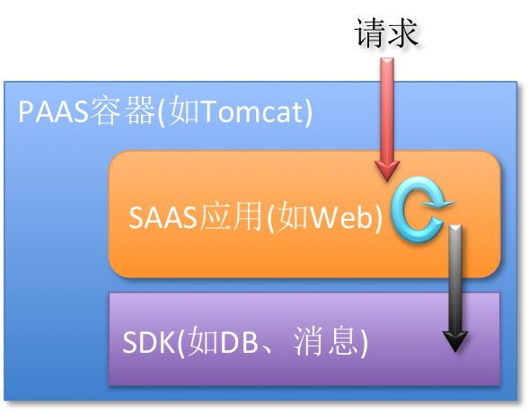

Transmittable ThreadLocal(TTL)
=====================================

[](https://travis-ci.org/alibaba/transmittable-thread-local)
[](https://codecov.io/github/alibaba/transmittable-thread-local?branch=master&view=all#sort=coverage&dir=asc)
[](https://maven-badges.herokuapp.com/maven-central/com.alibaba/transmittable-thread-local/)
[](https://github.com/alibaba/transmittable-thread-local/releases)  
[](https://www.versioneye.com/user/projects/56c0a36218b271002c699dca)
[](https://github.com/alibaba/transmittable-thread-local/issues)
[](https://www.apache.org/licenses/LICENSE-2.0.html)

<div align="right">
<a href="README-EN.md">English Documentation</a>
</div>

<!-- START doctoc generated TOC please keep comment here to allow auto update -->
<!-- DON'T EDIT THIS SECTION, INSTEAD RE-RUN doctoc TO UPDATE -->


- [:wrench: 功能](#wrench-%E5%8A%9F%E8%83%BD)
- [:art: 需求场景](#art-%E9%9C%80%E6%B1%82%E5%9C%BA%E6%99%AF)
  - [应用容器或上层框架跨应用代码给下层SDK传递信息](#%E5%BA%94%E7%94%A8%E5%AE%B9%E5%99%A8%E6%88%96%E4%B8%8A%E5%B1%82%E6%A1%86%E6%9E%B6%E8%B7%A8%E5%BA%94%E7%94%A8%E4%BB%A3%E7%A0%81%E7%BB%99%E4%B8%8B%E5%B1%82sdk%E4%BC%A0%E9%80%92%E4%BF%A1%E6%81%AF)
    - [上面场景使用`TTL`的整体构架](#%E4%B8%8A%E9%9D%A2%E5%9C%BA%E6%99%AF%E4%BD%BF%E7%94%A8ttl%E7%9A%84%E6%95%B4%E4%BD%93%E6%9E%84%E6%9E%B6)
  - [日志记录系统上下文](#%E6%97%A5%E5%BF%97%E8%AE%B0%E5%BD%95%E7%B3%BB%E7%BB%9F%E4%B8%8A%E4%B8%8B%E6%96%87)
- [:busts_in_silhouette: User Guide](#busts_in_silhouette-user-guide)
  - [1. 简单使用](#1-%E7%AE%80%E5%8D%95%E4%BD%BF%E7%94%A8)
  - [2. 保证线程池中传递值](#2-%E4%BF%9D%E8%AF%81%E7%BA%BF%E7%A8%8B%E6%B1%A0%E4%B8%AD%E4%BC%A0%E9%80%92%E5%80%BC)
    - [2.1 修饰`Runnable`和`Callable`](#21-%E4%BF%AE%E9%A5%B0runnable%E5%92%8Ccallable)
      - [这种使用方式的时序图](#%E8%BF%99%E7%A7%8D%E4%BD%BF%E7%94%A8%E6%96%B9%E5%BC%8F%E7%9A%84%E6%97%B6%E5%BA%8F%E5%9B%BE)
    - [2.2 修饰线程池](#22-%E4%BF%AE%E9%A5%B0%E7%BA%BF%E7%A8%8B%E6%B1%A0)
    - [2.3 使用Java Agent来修饰JDK线程池实现类](#23-%E4%BD%BF%E7%94%A8java-agent%E6%9D%A5%E4%BF%AE%E9%A5%B0jdk%E7%BA%BF%E7%A8%8B%E6%B1%A0%E5%AE%9E%E7%8E%B0%E7%B1%BB)
      - [`Java Agent`的使用方式在什么情况下`TTL`会失效](#java-agent%E7%9A%84%E4%BD%BF%E7%94%A8%E6%96%B9%E5%BC%8F%08%E5%9C%A8%E4%BB%80%E4%B9%88%E6%83%85%E5%86%B5%E4%B8%8Bttl%E4%BC%9A%E5%A4%B1%E6%95%88)
- [:electric_plug: Java API Docs](#electric_plug-java-api-docs)
- [:cookie: Maven依赖](#cookie-maven%E4%BE%9D%E8%B5%96)
- [:question: FAQ](#question-faq)
- [:moyai: 更多文档](#moyai-%E6%9B%B4%E5%A4%9A%E6%96%87%E6%A1%A3)
- [:books: 相关资料](#books-%E7%9B%B8%E5%85%B3%E8%B5%84%E6%96%99)
  - [Jdk core classes](#jdk-core-classes)
  - [Java Agent](#java-agent)

<!-- END doctoc generated TOC please keep comment here to allow auto update -->

:wrench: 功能
============================

:point_right: 在使用线程池等会缓存线程的组件情况下，提供`ThreadLocal`值的传递功能。

`JDK`的[`java.lang.InheritableThreadLocal`](http://docs.oracle.com/javase/7/docs/api/java/lang/InheritableThreadLocal.html)类可以完成父子线程值的传递。 但对于使用线程池等会缓存线程的组件的情况，线程由线程池创建好，并且线程是缓存起来反复使用的；这时父子线程关系的上下文传递已经没有意义，应用中要做上下文传递，实际上是在把 **任务提交给线程池时**的上下文传递到 **任务执行时**。

本库提供的[`TransmittableThreadLocal`](src/main/java/com/alibaba/ttl/TransmittableThreadLocal.java)类继承并加强[`java.lang.InheritableThreadLocal`](http://docs.oracle.com/javase/7/docs/api/java/lang/InheritableThreadLocal.html)类，解决上述的问题，使用详见[User Guide](#notebook-user-guide)。

欢迎 :clap:

- 建议和提问，[提交`Issue`](https://github.com/oldratlee/translations/issues/new)
- 贡献和改进，[`Fork`后提通过`Pull Request`贡献代码](https://github.com/oldratlee/translations/fork)

:art: 需求场景
============================

应用容器或上层框架跨应用代码给下层SDK传递信息
----------------------------

举个场景，`App Engine`（`PAAS`）上会运行由应用提供商提供的应用（`SAAS`模式）。多个`SAAS`用户购买并使用这个应用（即`SAAS`应用）。`SAAS`应用往往是一个实例为多个`SAAS`用户提供服务。    
\# 另一种模式是：`SAAS`用户使用完全独立一个`SAAS`应用，包含独立应用实例及其后的数据源（如`DB`、缓存，etc）。

需要避免的`SAAS`应用拿到多个`SAAS`用户的数据。

一个解决方法是处理过程关联一个`SAAS`用户的上下文，在上下文中应用只能处理（读&写）这个`SAAS`用户的数据。

请求由`SAAS`用户发起（如从`Web`请求进入`App Engine`），`App Engine`可以知道是从哪个`SAAS`用户，在`Web`请求时在上下文中设置好`SAAS`用户`ID`。

应用处理数据（`DB`、`Web`、消息 etc.）是通过`App Engine`提供的服务`SDK`来完成。当应用处理数据时，`SDK`检查数据所属的`SAAS`用户是否和上下文中的`SAAS`用户`ID`一致，如果不一致则拒绝数据的读写。

应用代码会使用线程池，并且这样的使用是正常的业务需求。`SAAS`用户`ID`的从要`App Engine`传递到下层`SDK`，要支持这样的用法。

### 上面场景使用`TTL`的整体构架



构架涉及3个角色：容器、用户应用、`SDK`。

整体流程：

1. 请求进入`PAAS`容器，提取上下文信息并设置好上下文。
2. 进入用户应用处理业务，业务调用`SDK`（如`DB`、消息、etc）。    
用户应用会使用线程池，所以调用`SDK`的线程可能不是请求的线程。
3. 进入`SDK`处理。    
提取上下文的信息，决定是否符合拒绝处理。

整个过程中，上下文的传递 对于 **用户应用代码** 期望是透明的。

日志记录系统上下文
----------------------------

`App Engine`的日志（如，`SDK`会记录日志）要记录系统上下文。由于不限制用户应用使用线程池，系统的上下文需要能跨线程的传递，且不影响应用代码。

:busts_in_silhouette: User Guide
=====================================

使用类[`TransmittableThreadLocal`](src/main/java/com/alibaba/ttl/TransmittableThreadLocal.java)来保存上下文，并跨线程池传递。

[`TransmittableThreadLocal`](src/main/java/com/alibaba/ttl/TransmittableThreadLocal.java)继承[`java.lang.InheritableThreadLocal`](http://docs.oracle.com/javase/7/docs/api/java/lang/InheritableThreadLocal.html)，使用方式也类似。

比[`java.lang.InheritableThreadLocal`](http://docs.oracle.com/javase/7/docs/api/java/lang/InheritableThreadLocal.html)，添加了`protected`方法`copy`，用于定制 **任务提交给线程池时**的上下文传递到 **任务执行时**时的拷贝行为，缺省是传递的是引用。

具体使用方式见下面的说明。

1. 简单使用
----------------------------

父线程给子线程传递值。

示例代码：

```java
// 在父线程中设置
TransmittableThreadLocal<String> parent = new TransmittableThreadLocal<String>();
parent.set("value-set-in-parent");

// =====================================================

// 在子线程中可以读取, 值是"value-set-in-parent"
String value = parent.get(); 
```

这是其实是[`java.lang.InheritableThreadLocal`](http://docs.oracle.com/javase/7/docs/api/java/lang/InheritableThreadLocal.html)的功能，应该使用[`java.lang.InheritableThreadLocal`](http://docs.oracle.com/javase/7/docs/api/java/lang/InheritableThreadLocal.html)来完成。

但对于使用了异步执行（往往使用线程池完成）的情况，线程由线程池创建好，并且线程是缓存起来反复使用的。

这时父子线程关系的上下文传递已经没有意义，应用中要做上下文传递，实际上是在把 **任务提交给线程池时**的上下文传递到 **任务执行时**。
解决方法参见下面的这几种用法。

2. 保证线程池中传递值
----------------------------

### 2.1 修饰`Runnable`和`Callable`

使用[`com.alibaba.ttl.TtlRunnable`](src/main/java/com/alibaba/ttl/TtlRunnable.java)和[`com.alibaba.ttl.TtlCallable`](src/main/java/com/alibaba/ttl/TtlCallable.java)来修饰传入线程池的`Runnable`和`Callable`。

示例代码：

```java
TransmittableThreadLocal<String> parent = new TransmittableThreadLocal<String>();
parent.set("value-set-in-parent");

Runnable task = new Task("1");
// 额外的处理，生成修饰了的对象ttlRunnable
Runnable ttlRunnable = TtlRunnable.get(task); 
executorService.submit(ttlRunnable);

// =====================================================

// Task中可以读取, 值是"value-set-in-parent"
String value = parent.get(); 
```

上面演示了`Runnable`，`Callable`的处理类似

```java
TransmittableThreadLocal<String> parent = new TransmittableThreadLocal<String>();
parent.set("value-set-in-parent");

Callable call = new Call("1");
// 额外的处理，生成修饰了的对象ttlCallable
Callable ttlCallable = TtlCallable.get(call); 
executorService.submit(ttlCallable);

// =====================================================

// Call中可以读取, 值是"value-set-in-parent"
String value = parent.get(); 
```

#### 这种使用方式的时序图


### 2.2 修饰线程池

省去每次`Runnable`和`Callable`传入线程池时的修饰，这个逻辑可以在线程池中完成。

通过工具类[`com.alibaba.ttl.threadpool.TtlExecutors`](src/main/java/com/alibaba/ttl/threadpool/TtlExecutors.java)完成，有下面的方法：

* `getTtlExecutor`：修饰接口`Executor`
* `getTtlExecutorService`：修饰接口`ExecutorService`
* `ScheduledExecutorService`：修饰接口`ScheduledExecutorService`

示例代码：

```java
ExecutorService executorService = ...
// 额外的处理，生成修饰了的对象executorService
executorService = TtlExecutors.getTtlExecutorService(executorService); 

TransmittableThreadLocal<String> parent = new TransmittableThreadLocal<String>();
parent.set("value-set-in-parent");

Runnable task = new Task("1");
Callable call = new Call("2");
executorService.submit(task);
executorService.submit(call);

// =====================================================

// Task或是Call中可以读取, 值是"value-set-in-parent"
String value = parent.get(); 
```

### 2.3 使用Java Agent来修饰JDK线程池实现类

这种方式，实现线程池的传递是透明的，代码中没有修饰`Runnable`或是线程池的代码。    
\# 即可以做到应用代码 **无侵入**，后面文档有结合实际场景的架构对这一点的说明。

示例代码：

```java
// 框架代码
TransmittableThreadLocal<String> parent = new TransmittableThreadLocal<String>();
parent.set("value-set-in-parent");

// 应用代码
ExecutorService executorService = Executors.newFixedThreadPool(3);

Runnable task = new Task("1");
Callable call = new Call("2");
executorService.submit(task);
executorService.submit(call);

// =====================================================

// Task或是Call中可以读取, 值是"value-set-in-parent"
String value = parent.get();
```

Demo参见[`AgentDemo.java`](src/test/java/com/alibaba/ttl/threadpool/agent/demo/AgentDemo.java)。

目前Agent中，修饰了`jdk`中的两个线程池实现类（实现代码在[`TtlTransformer.java`](src/main/java/com/alibaba/ttl/threadpool/agent/TtlTransformer.java)）：

- `java.util.concurrent.ThreadPoolExecutor`
- `java.util.concurrent.ScheduledThreadPoolExecutor`

在`Java`的启动参数加上：

- `-Xbootclasspath/a:/path/to/transmittable-thread-local-2.x.x.jar`
- `-javaagent:/path/to/transmittable-thread-local-2.x.x.jar`

**注意**： 

* Agent修改是JDK的类，类中加入了引用`TTL`的代码，所以`TTL Agent`的`Jar`要加到`bootclasspath`上。

Java命令行示例如下：

```bash
java -Xbootclasspath/a:transmittable-thread-local-2.0.0.jar \
    -javaagent:transmittable-thread-local-2.0.0.jar \
    -cp classes \
    com.alibaba.ttl.threadpool.agent.demo.AgentDemo
```

有Demo演示『使用Java Agent来修饰线程池实现类』，执行工程下的脚本[`run-agent-demo.sh`](run-agent-demo.sh)即可运行Demo。

#### `Java Agent`的使用方式在什么情况下`TTL`会失效

由于`Runnable`和`Callable`的修饰代码，是在线程池类中插入的。下面的情况会让插入的代码被绕过，传递会失效。

- 用户代码中继承`java.util.concurrent.ThreadPoolExecutor`和`java.util.concurrent.ScheduledThreadPoolExecutor`，
覆盖了`execute`、`submit`、`schedule`等提交任务的方法，并且没有调用父类的方法。   
修改线程池类的实现，`execute`、`submit`、`schedule`等提交任务的方法禁止这些被覆盖，可以规避这个问题。
- 目前，没有修饰`java.util.Timer`类，使用`Timer`时，`TTL`会有问题。

:electric_plug: Java API Docs
======================

当前版本的Java API文档地址： <http://alibaba.github.io/transmittable-thread-local/apidocs/>

:cookie: Maven依赖
=====================================

示例：

```xml
<dependency>
	<groupId>com.alibaba</groupId>
	<artifactId>transmittable-thread-local</artifactId>
	<version>2.0.0</version>
</dependency>
```

可以在 [search.maven.org](http://search.maven.org/#search%7Cgav%7C1%7Cg%3A%22com.alibaba%22%20AND%20a%3A%22transmittable-thread-local%22) 查看可用的版本。

:question: FAQ
=====================================

* Mac OS X下，使用javaagent，可能会报`JavaLaunchHelper`的出错信息。  
JDK Bug: http://bugs.sun.com/bugdatabase/view_bug.do?bug_id=8021205  
可以换一个版本的JDK。我的开发机上`1.7.0_40`有这个问题，`1.6.0_51`、`1.7.0_45`可以运行。   
\# `1.7.0_45`还是有`JavaLaunchHelper`的出错信息，但不影响运行。

:moyai: 更多文档
=====================================

- [Developer Guide](docs/developer-guide.md)
- [性能测试](docs/performance-test.md)

:books: 相关资料
=====================================

Jdk core classes
----------------------------

* [WeakHashMap](http://docs.oracle.com/javase/7/docs/api/java/util/WeakHashMap.html)
* [InheritableThreadLocal](http://docs.oracle.com/javase/7/docs/api/java/lang/InheritableThreadLocal.html)

Java Agent
----------------------------

* [Java Agent规范](http://docs.oracle.com/javase/7/docs/api/java/lang/instrument/package-summary.html)
* [Java SE 6 新特性: Instrumentation 新功能](http://www.ibm.com/developerworks/cn/java/j-lo-jse61/)
* [Creation, dynamic loading and instrumentation with javaagents](http://dhruba.name/2010/02/07/creation-dynamic-loading-and-instrumentation-with-javaagents/)
* [JavaAgent加载机制分析](http://alipaymiddleware.com/jvm/javaagent%E5%8A%A0%E8%BD%BD%E6%9C%BA%E5%88%B6%E5%88%86%E6%9E%90/)
