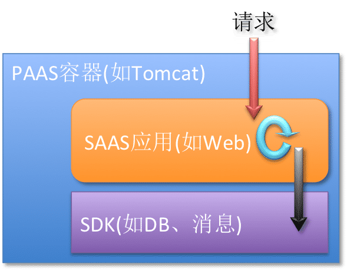

# 🎓 Developer Guide

---------------------------

<!-- START doctoc generated TOC please keep comment here to allow auto update -->
<!-- DON'T EDIT THIS SECTION, INSTEAD RE-RUN doctoc TO UPDATE -->


- [📌 框架/中间件集成`TTL`传递](#-%E6%A1%86%E6%9E%B6%E4%B8%AD%E9%97%B4%E4%BB%B6%E9%9B%86%E6%88%90ttl%E4%BC%A0%E9%80%92)
- [📟 关于`Java Agent`](#-%E5%85%B3%E4%BA%8Ejava-agent)
    - [`Java Agent`方式对应用代码无侵入](#java-agent%E6%96%B9%E5%BC%8F%E5%AF%B9%E5%BA%94%E7%94%A8%E4%BB%A3%E7%A0%81%E6%97%A0%E4%BE%B5%E5%85%A5)
    - [已有`Java Agent`中嵌入`TTL Agent`](#%E5%B7%B2%E6%9C%89java-agent%E4%B8%AD%E5%B5%8C%E5%85%A5ttl-agent)
- [👢 `Bootstrap ClassPath`上添加通用库`Jar`的问题及其解决方法](#-bootstrap-classpath%E4%B8%8A%E6%B7%BB%E5%8A%A0%E9%80%9A%E7%94%A8%E5%BA%93jar%E7%9A%84%E9%97%AE%E9%A2%98%E5%8F%8A%E5%85%B6%E8%A7%A3%E5%86%B3%E6%96%B9%E6%B3%95)
- [🔨 关于编译构建与`IDE`开发](#-%E5%85%B3%E4%BA%8E%E7%BC%96%E8%AF%91%E6%9E%84%E5%BB%BA%E4%B8%8Eide%E5%BC%80%E5%8F%91)
    - [如何编译构建](#%E5%A6%82%E4%BD%95%E7%BC%96%E8%AF%91%E6%9E%84%E5%BB%BA)
    - [如何用`IDE`开发](#%E5%A6%82%E4%BD%95%E7%94%A8ide%E5%BC%80%E5%8F%91)
        - [`IntelliJ IDEA`关闭检查的方法](#intellij-idea%E5%85%B3%E9%97%AD%E6%A3%80%E6%9F%A5%E7%9A%84%E6%96%B9%E6%B3%95)
        - [其它`IDE`的解决方法](#%E5%85%B6%E5%AE%83ide%E7%9A%84%E8%A7%A3%E5%86%B3%E6%96%B9%E6%B3%95)
- [📚 相关资料](#-%E7%9B%B8%E5%85%B3%E8%B5%84%E6%96%99)
    - [Jdk core classes](#jdk-core-classes)
    - [Java Agent](#java-agent)
    - [Javassist](#javassist)
    - [Shade插件](#shade%E6%8F%92%E4%BB%B6)

<!-- END doctoc generated TOC please keep comment here to allow auto update -->

---------------------------

# 📌 框架/中间件集成`TTL`传递

框架/中间件集成`TTL`传递，通过[`TransmittableThreadLocal.Transmitter`](../src/main/java/com/alibaba/ttl/TransmittableThreadLocal.java#L240)
抓取当前线程的所有`TTL`值并在其他线程进行回放；在回放线程执行完业务操作后，恢复为回放线程原来的`TTL`值。

[`TransmittableThreadLocal.Transmitter`](../src/main/java/com/alibaba/ttl/TransmittableThreadLocal.java#L201)提供了所有`TTL`值的抓取、回放和恢复方法（即`CRR`操作）：

1. `capture`方法：抓取线程（线程A）的所有`TTL`值。
2. `replay`方法：在另一个线程（线程B）中，回放在`capture`方法中抓取的`TTL`值，并返回 回放前`TTL`值的备份
3. `restore`方法：恢复线程B执行`replay`方法之前的`TTL`值（即备份）

示例代码：

```java
// ===========================================================================
// 线程 A
// ===========================================================================

TransmittableThreadLocal<String> parent = new TransmittableThreadLocal<String>();
parent.set("value-set-in-parent");

// (1) 抓取当前线程的所有TTL值
final Object captured = TransmittableThreadLocal.Transmitter.capture();

// ===========================================================================
// 线程 B（异步线程）
// ===========================================================================

// (2) 在线程 B中回放在capture方法中抓取的TTL值，并返回 回放前TTL值的备份
final Object backup = TransmittableThreadLocal.Transmitter.replay(captured);
try {
    // 你的业务逻辑，这里你可以获取到外面设置的TTL值
    String value = parent.get();

    System.out.println("Hello: " + value);
    ...
    String result = "World: " + value;
} finally {
    // (3) 恢复线程 B执行replay方法之前的TTL值（即备份）
    TransmittableThreadLocal.Transmitter.restore(backup);
}
```

`TTL`传递的具体实现示例参见 [`TtlRunnable.java`](../src/main/java/com/alibaba/ttl/TtlRunnable.java)、[`TtlCallable.java`](../src/main/java/com/alibaba/ttl/TtlCallable.java)。

当然可以使用`TransmittableThreadLocal.Transmitter`的工具方法`runSupplierWithCaptured`和`runCallableWithCaptured`和可爱的`Java 8 Lambda`语法
来简化`replay`和`restore`操作，示例代码：

```java
// ===========================================================================
// 线程 A
// ===========================================================================

TransmittableThreadLocal<String> parent = new TransmittableThreadLocal<String>();
parent.set("value-set-in-parent");

// (1) 抓取当前线程的所有TTL值
final Object captured = TransmittableThreadLocal.Transmitter.capture();

// ===========================================================================
// 线程 B（异步线程）
// ===========================================================================

String result = runSupplierWithCaptured(captured, () -> {
    // 你的业务逻辑，这里你可以获取到外面设置的TTL值
    String value = parent.get();
    System.out.println("Hello: " + value);
    ...
    return "World: " + value;
}); // (2) + (3)
```

更多`TTL`传递的说明详见[`TransmittableThreadLocal.Transmitter`](../src/main/java/com/alibaba/ttl/TransmittableThreadLocal.java#L240)的`JavaDoc`。

# 📟 关于`Java Agent`

## `Java Agent`方式对应用代码无侵入

[User Guide - 2.3 使用`Java Agent`来修饰`JDK`线程池实现类](../README.md#23-%E4%BD%BF%E7%94%A8java-agent%E6%9D%A5%E4%BF%AE%E9%A5%B0jdk%E7%BA%BF%E7%A8%8B%E6%B1%A0%E5%AE%9E%E7%8E%B0%E7%B1%BB) 说到了，相对修饰`Runnable`或是线程池的方式，`Java Agent`方式是对应用代码无侵入的。下面做一些展开说明。



按框架图，把前面示例代码操作可以分成下面几部分：

1. 读取信息设置到`TTL`。  
    这部分在容器中完成，无需应用参与。
2. 提交`Runnable`到线程池。要有修饰操作`Runnable`（无论是直接修饰`Runnable`还是修饰线程池）。  
    这部分操作一定是在用户应用中触发。
3. 读取`TTL`，做业务检查。  
    在`SDK`中完成，无需应用参与。

只有第2部分的操作和应用代码相关。

如果不通过`Java Agent`修饰线程池，则修饰操作需要应用代码来完成。

使用`Java Agent`方式，应用无需修改代码，即做到 相对应用代码 透明地完成跨线程池的上下文传递。

更多关于应用场景的了解说明参见文档[需求场景](requirement-scenario.md)。

## 已有`Java Agent`中嵌入`TTL Agent`

这样可以减少`Java`启动命令行上的`Agent`的配置。

在自己的`Agent`中加上`TTL Agent`的逻辑，示例代码如下（[`YourXxxAgent.java`](../src/test/java/com/alibaba/demo/ttl/agent/YourXxxAgent.java)）：

```java
import com.alibaba.ttl.threadpool.agent.TtlAgent;
import com.alibaba.ttl.threadpool.agent.TtlTransformer;

import java.lang.instrument.ClassFileTransformer;
import java.lang.instrument.Instrumentation;
import java.util.logging.Logger;

public final class YourXxxAgent {
    private static final Logger logger = Logger.getLogger(YourXxxAgent.class.getName());

    public static void premain(String agentArgs, Instrumentation inst) {
        TtlAgent.premain(agentArgs, inst); // add TTL Transformer

        // add your Transformer
        ...
    }
}
```

关于`Java Agent`和`ClassFileTransformer`的如何实现可以参考：[`TtlAgent.java`](../src/main/java/com/alibaba/ttl/threadpool/agent/TtlAgent.java)、[`TtlTransformer.java`](../src/main/java/com/alibaba/ttl/threadpool/agent/TtlTransformer.java)。

注意，在`bootclasspath`上，还是要加上`TTL Jar`：

```bash
-Xbootclasspath/a:/path/to/transmittable-thread-local-2.0.0.jar:/path/to/your/agent/jar/files
```

# 👢 `Bootstrap ClassPath`上添加通用库`Jar`的问题及其解决方法

通过`Java`命令参数`-Xbootclasspath`把库的`Jar`加`Bootstrap` `ClassPath`上。`Bootstrap` `ClassPath`上的`Jar`中类会优先于应用`ClassPath`的`Jar`被加载，并且不能被覆盖。

`TTL`在`Bootstrap ClassPath`上添加了`Javassist`的依赖，如果应用中如果使用了`Javassist`，实际上会优先使用`Bootstrap` `ClassPath`上的`Javassist`，即应用不能选择`Javassist`的版本，应用需要的`Javassist` 和 `TTL`用的`Javassist` 会有兼容性的风险。

可以通过`repackage`依赖（重命名/改写依赖的包名）来解决这个问题。

`Maven`提供了[`Shade`插件](http://maven.apache.org/plugins/maven-shade-plugin/)，可以完成`repackage`操作，并把`Javassist`类文件加到`TTL`的`Jar`中。

这样就不需要依赖外部的`Javassist`依赖，也规避了依赖冲突的问题。

# 🔨 关于编译构建与`IDE`开发

## 如何编译构建

编译构建的环境要求： **_`JDK 8~11`_**；用`Maven`常规的方式执行编译构建即可：  
\# 在工程中已经包含了符合版本要求的`Maven`，直接运行 **_工程根目录下的`mvnw`_**；并不需要先手动自己安装好`Maven`。

```bash
# 运行测试Case
./mvnw test
# 编译打包
./mvnw package
# 运行测试Case、编译打包、安装TTL库到Maven本地
./mvnw install

#####################################################
# 如果使用你自己安装的`Maven`，版本要求：maven 3.3.9+
mvn install
```

## 如何用`IDE`开发

`TTL`的代码实现使用了`JDK 8`的标准库类，但编译成`Java 6`版本的类文件。即

- 编译`Java`文件的`Java`语言版本 是 `Java 6`。
- 而编译依赖的`Java API`/标准库（由`JVM`提供） 需要是 `Java 8`/`JVM 8`；高于`Java`语言版本。

现代的`IDE`（如`IntelliJ IDEA`）一般会缺省做 语言版本 与 `API`版本 的检查：

- 如何使用了高于语言版本的标准库类，`IDE`会报错。
- 以避免在语言版本`JVM`运行时，可能会出`API`/标准类找不到的风险。

可以在`IDE`设置中，关闭这个『语言版本 与 `API`版本』检查。

### `IntelliJ IDEA`关闭检查的方法

在设置中关闭【`Inspections` - `Usages of API which isn't available at the configured language level`】：  


当然通过【`Find Actions...` <kbd>cmd + shift + A</kbd>】，可以更方便快速完成设置：  


### 其它`IDE`的解决方法

其它`IDE`（如`Eclipse`、`NetBeans`）可以找一下设置方法，以关闭这个『语言版本 与 `API`版本』检查。

如果没有找到`IDE`的设置方法，也可以用下面的方法来 **`workaround`**： 😂

打开 **_工程根目录下的`pom4ide.xml`文件_**（修改了`Java`文件的语言版本），而不是`pom.xml`。

# 📚 相关资料

## Jdk core classes

- [WeakHashMap](https://docs.oracle.com/javase/10/docs/api/java/util/WeakHashMap.html)
- [InheritableThreadLocal](https://docs.oracle.com/javase/10/docs/api/java/lang/InheritableThreadLocal.html)

## Java Agent

- 官方文档
    - [`Java Agent`规范 - `JavaDoc`](https://docs.oracle.com/javase/10/docs/api/java/lang/instrument/package-summary.html#package.description)
    - [JAR File Specification - JAR Manifest](https://docs.oracle.com/javase/10/docs/specs/jar/jar.html#jar-manifest)
    - [Working with Manifest Files - The Java™ TutorialsHide](https://docs.oracle.com/javase/tutorial/deployment/jar/manifestindex.html)
- [Java SE 6 新特性: Instrumentation 新功能](http://www.ibm.com/developerworks/cn/java/j-lo-jse61/)
- [Creation, dynamic loading and instrumentation with javaagents](http://dhruba.name/2010/02/07/creation-dynamic-loading-and-instrumentation-with-javaagents/)
- [JavaAgent加载机制分析](https://www.iteye.com/blog/nijiaben-1847212/)

## Javassist

- [Getting Started with Javassist](https://www.javassist.org/tutorial/tutorial.html)

## Shade插件

- `Maven`的[Shade](http://maven.apache.org/plugins/maven-shade-plugin/)插件
